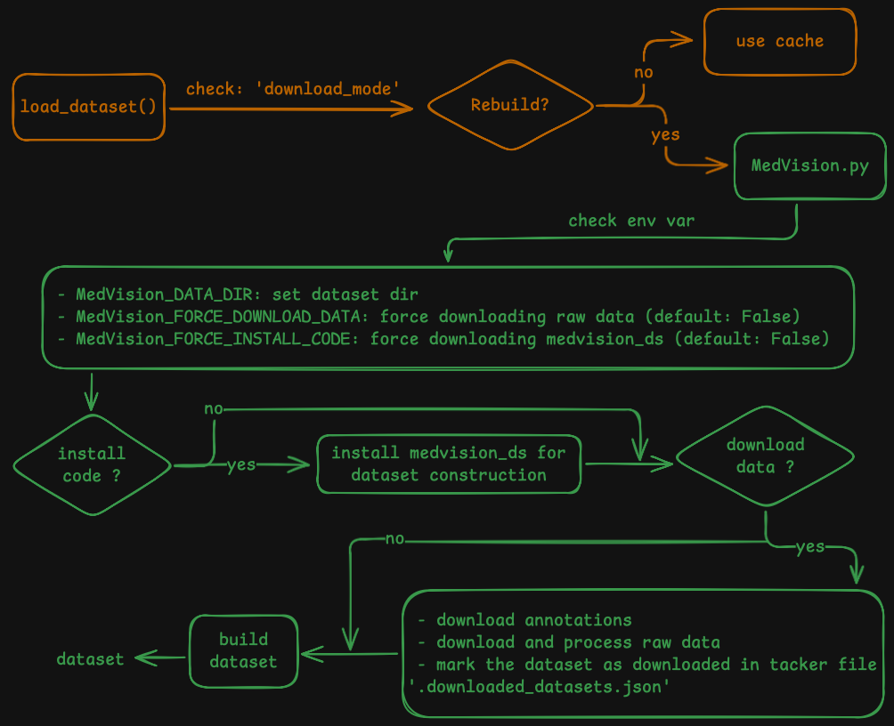
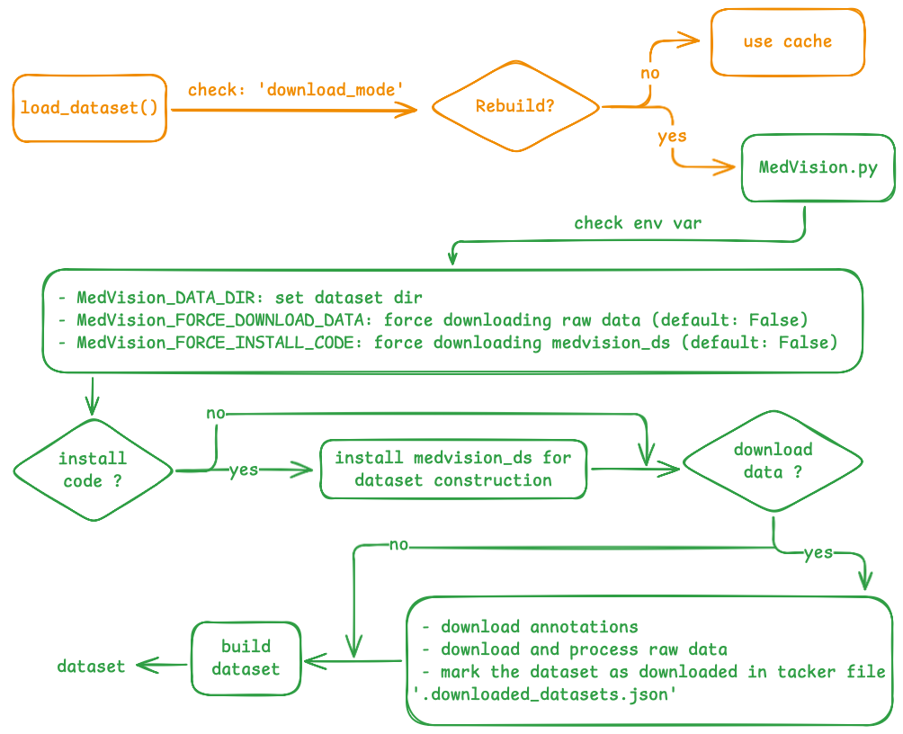

<div align="center">
  <br>

  # MedVision: Dataset and Benchmark for Quantitative Medical Image Analysis

  | 🌏 [**Project**](https://medvision-vlm.github.io) | 🧑🏻‍💻 [**Code**](https://github.com/YongchengYAO/MedVision) | 🩻 [**Dataset**](https://huggingface.co/datasets/YongchengYAO/MedVision) | 🐳 [**Docker**](https://hub.docker.com/r/vincentycyao/medvision/tags) | 🤗 [**Models**](https://huggingface.co/collections/YongchengYAO/medvision-sft-models) | 📖 [**arXiv**](https://arxiv.org/abs/2511.18676) |

  🔎 Benchmarking VLMs for detection, tumor/lesion size estimation, and angle/distance measurement from medical images 📏

  💿 30.8M annotated samples | multi-modality | multi-anatomy | 3D/2D medical image 💿

  🎯 Post-training: SFT, RFT (RL), CoT, LoRA | Framework: [TRL](https://github.com/huggingface/trl), [verl](https://github.com/volcengine/verl) 🎯

</div>


```
@misc{yao2025medvisiondatasetbenchmarkquantitative,
      title={MedVision: Dataset and Benchmark for Quantitative Medical Image Analysis}, 
      author={Yongcheng Yao and Yongshuo Zong and Raman Dutt and Yongxin Yang and Sotirios A Tsaftaris and Timothy Hospedales},
      year={2025},
      eprint={2511.18676},
      archivePrefix={arXiv},
      primaryClass={cs.CV},
      url={https://arxiv.org/abs/2511.18676}, 
}
```

<br/>

# 🔥 News

- [Dec 21, 2025] 🩻 Data & tasks preview: MedVision includes [area-estimation (`MaskSize`) tasks](https://huggingface.co/datasets/YongchengYAO/MedVision/blob/main/info/ConfigurationsList_All.csv)
- [Dec 20, 2025] 🎯 New recipe: [SFT with CoT data](https://github.com/YongchengYAO/MedVision/tree/master/script/sft), [build parquet dataset for RFT in verl](https://github.com/YongchengYAO/MedVision/tree/master/script/rft)
- [Dec 10, 2025] Add preprint, training code, docker images, released models, new tasks/models guide
- [Oct 8, 2025] 🚀 Release **MedVision** dataset v1.0.0

<br/>

# 🌟 Quick Start

For benchmarking and model post-training in this project, install `medvision_bm` and use the GitHub repo (`MedVision`) as working folder.

```bash
git clone https://github.com/YongchengYAO/MedVision.git MedVision
cd MedVision
pip install .
pip show medvision_bm
```

For integration in other projects, install with

```bash
pip install "git+https://github.com/YongchengYAO/MedVision.git"
pip show medvision_bm
```

<br/>

# 🐳 Use Docker

📝 Docker images are built from these [dockerfiles](https://github.com/YongchengYAO/MedVision/tree/master/dockerfile)

1. Choose the docker image for a specific model: https://hub.docker.com/r/vincentycyao/medvision/tags

   ```bash
   docker pull vincentycyao/medvision:<tag>
   ```

2. Map local volumes and GPUs, use docker image `vincentycyao/medvision:<tag>`

   ```bash
   # NOTE: replace </path/to/working/folder>, <tag>
   docker run -it --rm \
       --gpus all \
       -v </path/to/working/folder>:/root/Documents/MedVision \
       vincentycyao/medvision:<tag> \
       bash
   ```

   ```bash
   # In the container
   git clone https://github.com/YongchengYAO/MedVision.git /root/Documents/MedVision
   cd /root/Documents/MedVision

   # Check existing Conda env and activate 
   conda env list
   conda activate <env-name>

   # Install the latest medvision_bm
   pip install .
   pip show medvision_bm

   # Install the latest medvision_ds
   python -m medvision_bm.benchmark.install_medvision_ds --data_dir ./Data
   pip show medvision_ds
   ```

Next (in the container):

- Skip environment setup (recommended reading: [how to debug env setup error](https://github.com/YongchengYAO/MedVision/blob/master/docs/debug_env_setup.md)):

  - Benchmarking: use `--skip_env_setup` for scripts in ``/root/Documents/MedVision/script/benchmark-*``

  - SFT: disable this line in ``/root/Documents/MedVision/script/sft-*``

    ```bash
    python -m medvision_bm.sft.env_setup --data_dir ${data_dir}
    ```

> [!TIP]
> Treat the `MedVision` folder as the working directory.
>
> [File structure](https://github.com/YongchengYAO/MedVision/tree/master/docs/file-structure.md): imaging data, benchmark results, and model checkpoints are automatically saved

<br/>

# 📊 Benchmark

- **[Usage]** 

  1. The scripts in `script/benchmark-*/eval__*` should be sufficient for dependencies installation, data processing, and benchmarking

     > ⚠️
     >
     > Set these variables:
     >
     > - `benchmark_dir`: the working directory
     > - `model_hf_id`: Huggingface ID (`<user>/<model>`) of the tested model
     > - `model_name`: user-defined identifier for the tested model, used as folder name in `Results/MedVision-*/`
     > - resource-constrained configs, such as
     >   - `batch_size_per_gpu`
     >   - `CUDA_VISIBLE_DEVICES=0,1` 

  2. After evaluating all models in step 1, parse model outputs and calculate metrics (e.g., MRE, MAE, IoU, Success Rate):

     > ⚠️
     >
     > Known issue for some models: gemini-2.5
     >
     > Issue: Have to ensure no subfolder in each model folder before running the command below
     >
     > e.g.
     > 
     >`mv gemini-2.5-pro-woTool/gemini-2.5-pro/* gemini-2.5-pro-woTool/`

     ```bash
     # CLI command: 
     # python -m medvision_bm.benchmark.parse_outputs
     #
     # args:
     # --task_type: ["AD", "TL", "Detection"]
     # --task_dir: task folder
     # --model_dir: model folder
     # --limit: limit sample size in the parsed files
     # --skip_existing: (store_true arg) skip parsed files
     # --processes, -p: number of processes
     # --rm_old: remove existing "parsed" folder for each model 🔥
     
     # example 1: parse all models for the T/L task 
     python -m medvision_bm.benchmark.parse_outputs --task_type TL --task_dir Results/MedVision-TL -p 32

     # example 2: parse all models for the A/D task (remove existing `parsed` folder) 🔥
     python -m medvision_bm.benchmark.parse_outputs --task_type AD --task_dir Results/MedVision-AD -p 32 --rm_old
     
     # example 3: parse one model for the detection task and skip existing parsed files
     python -m medvision_bm.benchmark.parse_outputs --task_type Detection --model_dir Results/MedVision-detect/Qwen2.5-VL-32B-Instruct --skip_existing -p 32
     ```

  3. Summarize model performance for each task
      > ⚠️
      > 
      > If `medvision_ds` is missing, install with:
      > 
      > `python -m medvision_bm.benchmark.install_medvision_ds --data_dir <local-data-folder> `
    
      ```bash
      # CLI command: 
      # python -m medvision_bm.benchmark.summarize_AD_task 
      # python -m medvision_bm.benchmark.summarize_detection_task
      # python -m medvision_bm.benchmark.summarize_TL_task
      # python -m medvision_bm.benchmark.analyze_detection_task_boxsize
      # python -m medvision_bm.benchmark.analyze_detection_task_boxsize_vs_random
      #
      # args:
      # --task_dir: task folder
      # --model_dir: model folder
      # --limit: limit sample size in the parsed files 🔥
      # --skip_model_wo_parsed_files: skip model directories that don't have a 'parsed' folder
      # --processes, -p: number of processes 
      
      # example 1: summarize all models for the A/D task
      python -m medvision_bm.benchmark.summarize_AD_task --task_dir Results/MedVision-AD -p 32

      # example 2: summarize all models for the T/L task (limit sample size in the parsed files) 🔥
      # e.g. Your testing set limit is 1000, and you want to analyze the first 100 samples in each subtask because you want to compare with another ablation study where the testing set limit is 100. 
      python -m medvision_bm.benchmark.summarize_TL_task --task_dir Results/MedVision-TL -p 32 --limit 100
      
      # example 3: summarize one model for the detection task
      python -m medvision_bm.benchmark.summarize_detection_task --model_dir Results/MedVision-detect/Qwen2.5-VL-32B-Instruct -p 32
      
      # example 4: analyze how target size affect detection performance
      python -m medvision_bm.benchmark.analyze_detection_task_boxsize --task_dir Results/MedVision-detect -p 32
      
      # example 5: compare detection performance with random guessing
      python -m medvision_bm.benchmark.analyze_detection_task_boxsize_vs_random --task_dir Results/MedVision-detect -p 32
      ```


  File structure after these steps:

  ```text
  ├── MedVision
  │   ├── completed_tasks 
  │   │   ├── completed_tasks_MedVision-AD.json       # <== tasks status tracker
  │   │   ├── ...
  │   ├── Results                                     # <== benchmark results
  │   │   ├── MedVision-AD
  │   │   │   ├── ...
  │   │   │   ├── summary_AD_task.txt                 # <== [step 3] summary
  │   │   ├── MedVision-detect
  │   │   │   ├── Qwen2.5-VL-32B-Instruct
  │   │   │   │   ├── parsed                               
  │   │   │   │   │   ├── *.jsonl                     # <== [step 2] parsed model outputs
  │   │   │   │   │   ├── *.json                      # <== [step 2] parsed summary file
  │   │   │   │   │   ├── summary_*                   # <== [step 3] mean metrics, values
  │   │   │   │   ├── *.jsonl                         # <== [step 1] model outputs
  │   │   │   │   ├── *.json                          # <== [step 1] summary file
  │   │   │   ├── ...
  │   │   │   ├── summary_detection_task.txt          # <== [step 3] summary
  │   │   ├── MedVision-TL
  │   │   │   ├── ...
  │   │   │   ├── summary_TL_task.txt                 # <== [step 3] summary
  ```

- **[Troubleshooting]** [here](https://github.com/YongchengYAO/MedVision/tree/master/docs/debug_env_setup.md)

<br/>

# 🎯 Training: SFT

- **[Usage]** The scripts in `script/sft-*/train__SFT__*` should be sufficient for dependencies installation, data processing, and training.

  > ⚠️
  >
  > Set these variables in the script:
  >
  > - `benchmark_dir`: the working directory
  > - `base_model_hf`: Huggingface ID (`<user>/<model>`) of the base model
  > - `run_name`: an identifier for the current training
  > - `merged_model_hf`: Huggingface model name (`<model>`) of the merged model
  > - resource-constrained configs, such as
  >   - `per_device_train_batch_size`
  >   - `gradient_accumulation_steps`
  >   - `CUDA_VISIBLE_DEVICES=0,1,2,3` and `--num_processes=4`


- **[Troubleshooting]** [here](https://github.com/YongchengYAO/MedVision/tree/master/docs/debug_env_setup.md)

- **[Blog]** [Supervised Fine-Tuning (SFT) for VLMs on Medical Image Data](https://huggingface.co/blog/YongchengYAO/medvision-sft-guide)

- **[SFT Model Checkpoints]** [details](https://github.com/YongchengYAO/MedVision/tree/master/docs/SFT_model_checkpoints.md)

<br/>

# 📚 New Tasks/Models Guide

[New tasks guide](https://github.com/YongchengYAO/MedVision/blob/master/docs/New-Tasks-Guide.md) | [New models guide](https://github.com/YongchengYAO/MedVision/blob/master/docs/New-Models-Guide.md) 

<br/>

# 📖 Essential Dataset Concept

We cover some essential concepts that help we use the MedVision dataset with ease.

## Concepts: Dataset & Data Configuration

- `MedVision`: the collection of public imaging data and our annotations
- `dataset`: name of the public datasets, such `BraTS24`, `MSD`, `OAIZIB-CM`
- `data-config`: name of predefined subsets
  - naming convention: `{dataset}_{annotation-type}_{task-ID}_{slice}_{split}`
    - `dataset`: [details](https://huggingface.co/datasets/YongchengYAO/MedVision#datasets)
    - `annotation-type`: 
      - `BoxSize`: detection annotations (bounding box)
      - `TumorLesionSize`: tumor/lesion size annotations
      - `BiometricsFromLandmarks`: angle/distance annotations
    - `task-ID`: `Task[xx]` (Note, this is a local ID in the dataset, not a glocal ID in MedVision.)
      - For datasets with multiple image-mask pairs, we defined tasks in `medvision_ds/datasets/*/preprocess_*.py`
      - source: [medvision_ds](https://huggingface.co/datasets/YongchengYAO/MedVision/tree/main/src)
      - e.g., detection tasks for the `BraTS24` dataset is defined in the `benchmark_plan` in `medvision_ds/datasets/BraTS24/preprocess_detection.py`
    - `slice`: [`Sagittal`, `Coronal`, `Axial`]
    - `split`: [`Train`, `Test`]

## What's returned from MedVision Dataset?

We only share the annotations (https://huggingface.co/datasets/YongchengYAO/MedVision/tree/main/Datasets). The data loading script [`MedVision.py`](https://huggingface.co/datasets/YongchengYAO/MedVision/blob/main/MedVision.py) will handle raw image downloading and processing. The returned fields in each sample is defined as followed.

In `MedVision.py`, the class `MedVision(GeneratorBasedBuilder)` defines the feature dict and the method `_generate_examples()` builds the dataset.


<details>
<summary>Code block in `MedVision(GeneratorBasedBuilder)` (Click to expand)</summary>

  ``` python
  """
  MedVision dataset.

  NOTE: To update the features returned by the load_dataset() method, the followings should be updated:
          - the feature dict in this class 
          - the dict yielded by the _generate_examples() method 
  """

  # The feature dict for the task:
  # - Mask-Size
  features_dict_MaskSize = {
      "dataset_name": Value("string"),
      "taskID": Value("string"),
      "taskType": Value("string"),
      "image_file": Value("string"),
      "mask_file": Value("string"),
      "slice_dim": Value("uint8"),
      "slice_idx": Value("uint16"),
      "label": Value("uint16"),
      "image_size_2d": Sequence(Value("uint16"), length=2),
      "pixel_size": Sequence(Value("float16"), length=2),
      "image_size_3d": Sequence(Value("uint16"), length=3),
      "voxel_size": Sequence(Value("float16"), length=3),
      "pixel_count": Value("uint32"),
      "ROI_area": Value("float16"),
  }

  # The feature dict for the task:
  # - Box-Size
  features_dict_BoxSize = {
      "dataset_name": Value("string"),
      "taskID": Value("string"),
      "taskType": Value("string"),
      "image_file": Value("string"),
      "mask_file": Value("string"),
      "slice_dim": Value("uint8"),
      "slice_idx": Value("uint16"),
      "label": Value("uint16"),
      "image_size_2d": Sequence(Value("uint16"), length=2),
      "pixel_size": Sequence(Value("float16"), length=2),
      "image_size_3d": Sequence(Value("uint16"), length=3),
      "voxel_size": Sequence(Value("float16"), length=3),
      "bounding_boxes": Sequence(
          {
              "min_coords": Sequence(Value("uint16"), length=2),
              "max_coords": Sequence(Value("uint16"), length=2),
              "center_coords": Sequence(Value("uint16"), length=2),
              "dimensions": Sequence(Value("uint16"), length=2),
              "sizes": Sequence(Value("float16"), length=2),
          },
      ),
  }

  features_dict_BiometricsFromLandmarks = {
      "dataset_name": Value("string"),
      "taskID": Value("string"),
      "taskType": Value("string"),
      "image_file": Value("string"),
      "landmark_file": Value("string"),
      "slice_dim": Value("uint8"),
      "slice_idx": Value("uint16"),
      "image_size_2d": Sequence(Value("uint16"), length=2),
      "pixel_size": Sequence(Value("float16"), length=2),
      "image_size_3d": Sequence(Value("uint16"), length=3),
      "voxel_size": Sequence(Value("float16"), length=3),
      "biometric_profile": {
          "metric_type": Value("string"),
          "metric_map_name": Value("string"),
          "metric_key": Value("string"),
          "metric_value": Value("float16"),
          "metric_unit": Value("string"),
          "slice_dim": Value("uint8"),
      },
  }

  features_dict_TumorLesionSize = {
      "dataset_name": Value("string"),
      "taskID": Value("string"),
      "taskType": Value("string"),
      "image_file": Value("string"),
      "landmark_file": Value("string"),
      "mask_file": Value("string"),
      "slice_dim": Value("uint8"),
      "slice_idx": Value("uint16"),
      "label": Value("uint16"),
      "image_size_2d": Sequence(Value("uint16"), length=2),
      "pixel_size": Sequence(Value("float16"), length=2),
      "image_size_3d": Sequence(Value("uint16"), length=3),
      "voxel_size": Sequence(Value("float16"), length=3),
      "biometric_profile": Sequence(
          {
              "metric_type": Value("string"),
              "metric_map_name": Value("string"),
              "metric_key_major_axis": Value("string"),
              "metric_value_major_axis": Value("float16"),
              "metric_key_minor_axis": Value("string"),
              "metric_value_minor_axis": Value("float16"),
              "metric_unit": Value("string"),
          },
      ),
  }
  ```

</details>


<details>
<summary>Code block in `_generate_examples` (Click to expand)</summary>

  ```python
  # Task type: Mask-Size
  if taskType == "Mask-Size":
      flatten_slice_profiles = (
          MedVision_BenchmarkPlannerSegmentation.flatten_slice_profiles_2d
      )
      if imageSliceType.lower() == "sagittal":
          slice_dim = 0
      elif imageSliceType.lower() == "coronal":
          slice_dim = 1
      elif imageSliceType.lower() == "axial":
          slice_dim = 2
      slice_profile_flattened = flatten_slice_profiles(biometricData, slice_dim)
      for idx, case in enumerate(slice_profile_flattened):
          # Skip cases with a mask size smaller than 200 pixels
          if case["pixel_count"] < 200:
              continue
          else:
              yield idx, {
                  "dataset_name": dataset_name,
                  "taskID": taskID,
                  "taskType": taskType,
                  "image_file": os.path.join(dataset_dir, case["image_file"]),
                  "mask_file": os.path.join(dataset_dir, case["mask_file"]),
                  "slice_dim": case["slice_dim"],
                  "slice_idx": case["slice_idx"],
                  "label": case["label"],
                  "image_size_2d": case["image_size_2d"],
                  "pixel_size": case["pixel_size"],
                  "image_size_3d": case["image_size_3d"],
                  "voxel_size": case["voxel_size"],
                  "pixel_count": case["pixel_count"],
                  "ROI_area": case["ROI_area"],
              }

  # Task type: Box-Size
  if taskType == "Box-Size":
      if imageType.lower() == "2d":
          flatten_slice_profiles = (
              MedVision_BenchmarkPlannerDetection.flatten_slice_profiles_2d
          )
          if imageSliceType.lower() == "sagittal":
              slice_dim = 0
          elif imageSliceType.lower() == "coronal":
              slice_dim = 1
          elif imageSliceType.lower() == "axial":
              slice_dim = 2
          slice_profile_flattened = flatten_slice_profiles(
              biometricData, slice_dim
          )
          for idx, case in enumerate(slice_profile_flattened):
              # Skip cases with multiple bounding boxes in the same slice
              if len(case["bounding_boxes"]) > 1:
                  continue
              # Skip cases with a bounding box size smaller than 10 pixels in any dimension
              elif (
                  case["bounding_boxes"][0]["dimensions"][0] < 10
                  or case["bounding_boxes"][0]["dimensions"][1] < 10
              ):
                  continue
              else:
                  yield idx, {
                      "dataset_name": dataset_name,
                      "taskID": taskID,
                      "taskType": taskType,
                      "image_file": os.path.join(dataset_dir, case["image_file"]),
                      "mask_file": os.path.join(dataset_dir, case["mask_file"]),
                      "slice_dim": case["slice_dim"],
                      "slice_idx": case["slice_idx"],
                      "label": case["label"],
                      "image_size_2d": case["image_size_2d"],
                      "pixel_size": case["pixel_size"],
                      "image_size_3d": case["image_size_3d"],
                      "voxel_size": case["voxel_size"],
                      "bounding_boxes": case["bounding_boxes"],
                  }

  # Task type: Biometrics-From-Landmarks
  if taskType == "Biometrics-From-Landmarks":
      if imageType.lower() == "2d":
          flatten_slice_profiles = (
              MedVision_BenchmarkPlannerBiometry.flatten_slice_profiles_2d
          )
          if imageSliceType.lower() == "sagittal":
              slice_dim = 0
          elif imageSliceType.lower() == "coronal":
              slice_dim = 1
          elif imageSliceType.lower() == "axial":
              slice_dim = 2
          slice_profile_flattened = flatten_slice_profiles(
              biometricData, slice_dim
          )
          for idx, case in enumerate(slice_profile_flattened):
              yield idx, {
                  "dataset_name": dataset_name,
                  "taskID": taskID,
                  "taskType": taskType,
                  "image_file": os.path.join(dataset_dir, case["image_file"]),
                  "landmark_file": os.path.join(
                      dataset_dir, case["landmark_file"]
                  ),
                  "slice_dim": case["slice_dim"],
                  "slice_idx": case["slice_idx"],
                  "image_size_2d": case["image_size_2d"],
                  "pixel_size": case["pixel_size"],
                  "image_size_3d": case["image_size_3d"],
                  "voxel_size": case["voxel_size"],
                  "biometric_profile": case["biometric_profile"],
              }

  # Task type: Biometrics-From-Landmarks-Distance
  if taskType == "Biometrics-From-Landmarks-Distance":
      if imageType.lower() == "2d":
          flatten_slice_profiles = (
              MedVision_BenchmarkPlannerBiometry.flatten_slice_profiles_2d
          )
          if imageSliceType.lower() == "sagittal":
              slice_dim = 0
          elif imageSliceType.lower() == "coronal":
              slice_dim = 1
          elif imageSliceType.lower() == "axial":
              slice_dim = 2
          slice_profile_flattened = flatten_slice_profiles(
              biometricData, slice_dim
          )
          for idx, case in enumerate(slice_profile_flattened):
              if case["biometric_profile"]["metric_type"] == "distance":
                  yield idx, {
                      "dataset_name": dataset_name,
                      "taskID": taskID,
                      "taskType": taskType,
                      "image_file": os.path.join(dataset_dir, case["image_file"]),
                      "landmark_file": os.path.join(
                          dataset_dir, case["landmark_file"]
                      ),
                      "slice_dim": case["slice_dim"],
                      "slice_idx": case["slice_idx"],
                      "image_size_2d": case["image_size_2d"],
                      "pixel_size": case["pixel_size"],
                      "image_size_3d": case["image_size_3d"],
                      "voxel_size": case["voxel_size"],
                      "biometric_profile": case["biometric_profile"],
                  }

  # Task type: Biometrics-From-Landmarks-Angle
  if taskType == "Biometrics-From-Landmarks-Angle":
      if imageType.lower() == "2d":
          flatten_slice_profiles = (
              MedVision_BenchmarkPlannerBiometry.flatten_slice_profiles_2d
          )
          if imageSliceType.lower() == "sagittal":
              slice_dim = 0
          elif imageSliceType.lower() == "coronal":
              slice_dim = 1
          elif imageSliceType.lower() == "axial":
              slice_dim = 2
          slice_profile_flattened = flatten_slice_profiles(
              biometricData, slice_dim
          )
          for idx, case in enumerate(slice_profile_flattened):
              if case["biometric_profile"]["metric_type"] == "angle":
                  yield idx, {
                      "dataset_name": dataset_name,
                      "taskID": taskID,
                      "taskType": taskType,
                      "image_file": os.path.join(dataset_dir, case["image_file"]),
                      "landmark_file": os.path.join(
                          dataset_dir, case["landmark_file"]
                      ),
                      "slice_dim": case["slice_dim"],
                      "slice_idx": case["slice_idx"],
                      "image_size_2d": case["image_size_2d"],
                      "pixel_size": case["pixel_size"],
                      "image_size_3d": case["image_size_3d"],
                      "voxel_size": case["voxel_size"],
                      "biometric_profile": case["biometric_profile"],
                  }

  # Task type: Tumor-Lesion-Size
  if taskType == "Tumor-Lesion-Size":
      if imageType.lower() == "2d":
          # Get the target label for the task
          target_label = benchmark_plan["tasks"][int(taskID) - 1]["target_label"]

          flatten_slice_profiles = (
              MedVision_BenchmarkPlannerBiometry_fromSeg.flatten_slice_profiles_2d
          )
          if imageSliceType.lower() == "sagittal":
              slice_dim = 0
          elif imageSliceType.lower() == "coronal":
              slice_dim = 1
          elif imageSliceType.lower() == "axial":
              slice_dim = 2
          slice_profile_flattened = flatten_slice_profiles(
              biometricData, slice_dim
          )
          for idx, case in enumerate(slice_profile_flattened):
              # Skip cases with multiple fitted ellipses in the same slice
              if len(case["biometric_profile"]) > 1:
                  continue
              else:
                  yield idx, {
                      "dataset_name": dataset_name,
                      "taskID": taskID,
                      "taskType": taskType,
                      "image_file": os.path.join(dataset_dir, case["image_file"]),
                      "mask_file": os.path.join(dataset_dir, case["mask_file"]),
                      "landmark_file": os.path.join(
                          dataset_dir, case["landmark_file"]
                      ),
                      "slice_dim": case["slice_dim"],
                      "slice_idx": case["slice_idx"],
                      "label": target_label,
                      "image_size_2d": case["image_size_2d"],
                      "pixel_size": case["pixel_size"],
                      "image_size_3d": case["image_size_3d"],
                      "voxel_size": case["voxel_size"],
                      "biometric_profile": case["biometric_profile"],
                  }

  ```
</details>

## Dataset Building Workflow

### Workflow

<details>
<summary> MedVision Dataset Building Workflow (Black) </summary>
<br>
</details>

<details>
<summary> MedVision Dataset Building Workflow (White) </summary>
<br>
</details>

</br>

There are a few venues to control the dataset loading and building behavior:

- **Rebuild Dataset (Arrow files)**: Use the `download_mode` argument in `load_dataset()` ([docs](https://huggingface.co/docs/datasets/v3.6.0/en/package_reference/builder_classes#datasets.DownloadMode)).
  - **[1]** Set `download_mode="force_redownload"` to ignore the cached Arrow files and trigger the data loading script `MedVision.py` to rebuild the dataset.
- **Redownload Raw Data**:
  - **[2]** `MedVision_FORCE_DOWNLOAD_DATA`: Set this environment variable to `True` to force re-downloading raw images and annotations.
  - **[3]** `.downloaded_datasets.json`: This tracker file records downloaded status. Removing a dataset's entry here will trigger a re-download of the raw data for that dataset.
  
> [!Note] ⚠️ 
> **How to properly update/redownload raw data?**
>
> If you need to update raw data (images, masks, landmarks) using [2] or [3], you **MUST ALSO** use [1] (`download_mode="force_redownload"`).
>
> Why? Because if Hugging Face finds a valid cached dataset (Arrow files), it will load it directly and **skip running the script entirely**. Without running the script, the environment variable [2] or tracker file [3] will never be checked.
>
> **Summary:**
> - Update Arrow/Fields only: Use [1].
> - Update Raw Data: Use [1] **AND** ([2] or [3]).
>
> 🔥 We will maintain a [change log](https://huggingface.co/datasets/YongchengYAO/MedVision/blob/main/doc/changelog.md) for essential updates.


### Examples

<details>
<summary> Run this for the first time will download the raw data and build the dataset </summary>

```python
import os
from datasets import load_dataset

# Set data folder
wd = os.path.join(os.getcwd(), "Data-testing")
os.makedirs(wd, exist_ok=True)
os.environ["MedVision_DATA_DIR"] = wd

# Pick a dataset config name and split
config = "OAIZIB-CM_BoxSize_Task01_Axial_Test"
split_name = "test" # use "test" for testing set config; use "train" for training set config 

# Get dataset
ds = load_dataset(
        "YongchengYAO/MedVision",
        name=config,
        trust_remote_code=True,
        split=split_name,
    )
```
</details>

<details>
<summary> Run the same script again will use the cached dataset </summary>

```python
import os
from datasets import load_dataset

# Set data folder
wd = os.path.join(os.getcwd(), "Data-testing")
os.makedirs(wd, exist_ok=True)
os.environ["MedVision_DATA_DIR"] = wd

# Pick a dataset config name and split
config = "OAIZIB-CM_BoxSize_Task01_Axial_Test"
split_name = "test" # use "test" for testing set config; use "train" for training set config 

# Get dataset
ds = load_dataset(
        "YongchengYAO/MedVision",
        name=config,
        trust_remote_code=True,
        split=split_name,
    )
```
</details>

<details>
<summary> Adding `download_mode="force_redownload"` will skip raw data downloading and rebuild the dataset </summary>

```python
import os
from datasets import load_dataset

# Set data folder
wd = os.path.join(os.getcwd(), "Data-testing")
os.makedirs(wd, exist_ok=True)
os.environ["MedVision_DATA_DIR"] = wd

# Pick a dataset config name and split
config = "OAIZIB-CM_BoxSize_Task01_Axial_Test"
split_name = "test" # use "test" for testing set config; use "train" for training set config 

# Get dataset
ds = load_dataset(
        "YongchengYAO/MedVision",
        name=config,
        trust_remote_code=True,
        split=split_name,
        download_mode="force_redownload",
    )
```
</details>

<details>
<summary> Adding `download_mode="force_redownload"` and `os.environ["MedVision_FORCE_DOWNLOAD_DATA"] = "True"` will redownload raw data and rebuild the dataset </summary>

```python
import os
from datasets import load_dataset

# Set data folder
wd = os.path.join(os.getcwd(), "Data-testing")
os.makedirs(wd, exist_ok=True)
os.environ["MedVision_DATA_DIR"] = wd

# Pick a dataset config name and split
config = "OAIZIB-CM_BoxSize_Task01_Axial_Test"
split_name = "test" # use "test" for testing set config; use "train" for training set config 

# Force redownload
os.environ["MedVision_FORCE_DOWNLOAD_DATA"] = "True"

# Get dataset
ds = load_dataset(
        "YongchengYAO/MedVision",
        name=config,
        trust_remote_code=True,
        split=split_name,
        download_mode="force_redownload",
    )
```
</details>


## Download Mode in MedVision Dataset

<details>
<summary> (Advanced) Understand how the customized dataset loading script `MedVision.py` changes the behavior of `download_mode` in `load_dataset()` </summary>

- `download_mode` can be one of these: `"reuse_dataset_if_exists"` (default), `"reuse_cache_if_exists"`, `"force_redownload"`

- Default behavior of `download_mode` in `load_dataset()`:
    |                                   | Downloads | Dataset |
    | :-------------------------------- | :-------- | :------ |
    | reuse_dataset_if_exists (default) | Reuse     | Reuse   |
    | reuse_cache_if_exists             | Reuse     | Fresh   |
    | force_redownload                  | Fresh     | Fresh   |

- `download_mode` in MedVision dataset:
    |                                                        | Downloads | Dataset |
    | :----------------------------------------------------- | :-------- | :------ |
    | reuse_dataset_if_exists (default)                      | Reuse     | Reuse   |
    | reuse_cache_if_exists                                  | Reuse     | Fresh   |
    | force_redownload (MedVision_FORCE_DOWNLOAD_DATA=False) | Reuse     | Fresh   |
    | force_redownload (MedVision_FORCE_DOWNLOAD_DATA=True)  | Fresh     | Fresh   |
</details>

🔥 Summary: [Understanding the download mode of MedVision dataset](https://github.com/YongchengYAO/MedVision/issues/11)

<br/>

# 💿 Data Downloading (Optional)

Since data downloading and processing takes time, you can download datasets from the tasks list (example [here](https://github.com/YongchengYAO/MedVision/tree/master/tasks_list)) or configs list (example [here](https://huggingface.co/datasets/YongchengYAO/MedVision/tree/main/info)) in advance.

> [!NOTE]
> ⚠️ You need to set API token for these datasets (see [detailed instructions](https://huggingface.co/datasets/YongchengYAO/MedVision#datasets)): FeTA24, SKM-TEA, and ToothFairy2

```bash
# CLI command:
# python -m medvision_bm.benchmark.download_datasets
#
# arg:
# --data_dir: (required) data folder
# --tasks_json: task json file
# --configs_csv: config json file
# --force_download_data: (store_true arg) force redownload raw imaging data
# ⚠️ `--force_download_data` is for debugging only, it will repeatedly download data for tasks/configs of the same dataset

# NOTE: replace <task-list-json>, <data-folder>
python -m medvision_bm.benchmark.download_datasets --tasks_json <task-list-json> --data_dir <data-folder>
```

or

```bash
# NOTE: replace <config-list-csv>, <data-folder>
python -m medvision_bm.benchmark.download_datasets --configs_csv <config-list-csv> --data_dir <data-folder>
```

<br/>

# 🔧 Install `medvision_ds` (Optional)

`medvision_ds` is the dataset codebase. It can be installed from `medvision_bm`:

```bash
# Replace <local-data-folder>
python -m medvision_bm.benchmark.install_medvision_ds --data_dir <local-data-folder>  
```

<br/>

# 📝 Miscellaneous
If you encounter "missing package" error when using modules in `src/medvision_bm/sft`, install dependencies with
```bash
python -m medvision_bm.sft.env_setup --data_dir <local-data-folder>
```

<br/>

# 🩵 Acknowledgement
MedVision is based on some open-source projects:
- [EvolvingLMMs-Lab/lmms-eval](https://github.com/EvolvingLMMs-Lab/lmms-eval): VLM evaluation framework
- [EleutherAI/lm-evaluation-harness](https://github.com/EleutherAI/lm-evaluation-harness): LLM evaluation framework

<br/>